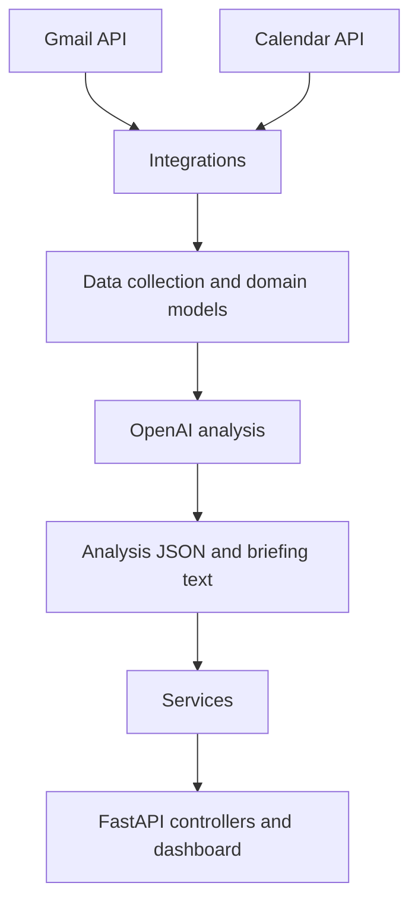

# Personal Executive AI Assistant

A local-first Python assistant that reads Gmail and Google Calendar, converts daily context into structured data, uses an OpenAI model to generate an executive briefing, and presents results through a FastAPI web dashboard.

> **Project status:** working reference implementation. The current checkpoint includes the end-to-end workflow, scheduled execution, an MVC-style dashboard, historical run drill-down, and 23 automated tests.

## Why this project exists

Email and calendar applications contain much of a person's daily context, but they rarely turn that context into a concise plan. This project demonstrates how to combine read-only Google integrations, typed Python models, an LLM, scheduled execution, and a lightweight dashboard to produce an actionable daily briefing.

## Current capabilities

- Authenticates with Google OAuth 2.0.
- Reads Gmail messages using a read-only scope.
- Reads Google Calendar events using a read-only scope.
- Normalises external data into Pydantic domain models.
- Generates structured priorities, observations, and suggested actions.
- Produces a plain-text executive briefing.
- Stores run outputs locally for auditability and historical review.
- Runs manually or on a schedule.
- Exposes a FastAPI API and Jinja-based dashboard.
- Displays dashboard, briefing, history, usage, and system views.
- Opens a specific historical run through `/history/{run_id}`.
- Includes 23 automated tests at the documented checkpoint.

## Architecture



The code follows a layered, MVC-inspired structure:

| Layer | Responsibility |
| --- | --- |
| `controllers/` | HTTP routes and template responses |
| `services/` | Application and business logic |
| `models/` | Domain, API, and view models |
| `integrations/` | Google OAuth, Gmail, Calendar, and OpenAI clients |
| `templates/` | Replaceable Jinja dashboard views |
| `static/` | CSS and browser assets |
| `tests/` | Automated unit and controller tests |

## Prerequisites

- Python 3.11 (the implementation was developed with Python 3.11.5)
- Git
- A Google account
- A Google Cloud project with Gmail API and Google Calendar API enabled
- An OpenAI API account with available credit

The ChatGPT subscription and OpenAI API billing are separate. An API key and API credit are required for this application.

## Quick start

```bash
git clone https://github.com/kuensom/personal-executive-ai.git
cd personal-executive-ai

python3.11 -m venv .venv
source .venv/bin/activate

python -m pip install --upgrade pip setuptools wheel
python -m pip install -r requirements.txt

cp .env.example .env
```

Then:

1. Follow [Google Cloud and OAuth setup](docs/03-google-cloud-oauth.md).
2. Follow [OpenAI setup](docs/04-openai-setup.md).
3. Confirm that `.env`, `credentials.json`, `token.json`, and `logs/` are ignored by Git.
4. Run the tests: `python -m pytest`.
5. Run the application using the entry point documented by the repository. At the current checkpoint this is expected to be `python -m app.scheduled_runner`.
6. Start the dashboard: `python -m uvicorn app.api:app --reload`.
7. Open <http://127.0.0.1:8000/>.

See [Local installation](docs/02-local-installation.md) for the complete, verified sequence.

## Configuration

Copy `.env.example` to `.env` and provide your own values:

```dotenv
OPENAI_API_KEY=replace-with-your-own-key
OPENAI_MODEL=gpt-5.6-luna
GOOGLE_CREDENTIALS_FILE=credentials.json
GOOGLE_TOKEN_FILE=token.json
LOG_DIR=logs
```

Never commit real keys, OAuth client secrets, access tokens, email content, calendar data, or generated personal briefings.

## Google access model

The project should use least-privilege scopes:

```text
https://www.googleapis.com/auth/gmail.readonly
https://www.googleapis.com/auth/calendar.readonly
```

The OAuth client should normally be a **Desktop app** client. Each person reproducing this project must create and download their own `credentials.json`.

## Running the dashboard

```bash
python -m uvicorn app.api:app --reload
```

Useful local URLs:

- Dashboard: <http://127.0.0.1:8000/>
- Latest briefing: <http://127.0.0.1:8000/briefing>
- History: <http://127.0.0.1:8000/history>
- Usage: <http://127.0.0.1:8000/usage>
- System status: <http://127.0.0.1:8000/system>
- OpenAPI documentation: <http://127.0.0.1:8000/docs>

The dashboard is intended for local use. Do not expose it directly to the public internet without authentication, HTTPS, access controls, and a production deployment review.

## Testing

```bash
python -m pytest
```

The documented checkpoint has **23 passing tests**. The suite covers models, services, API behaviour, dashboard pages, empty states, and historical run retrieval. See [Testing and verification](docs/08-testing.md).

## Documentation

1. [Architecture](docs/01-architecture.md)
2. [Local installation](docs/02-local-installation.md)
3. [Google Cloud and OAuth](docs/03-google-cloud-oauth.md)
4. [OpenAI setup](docs/04-openai-setup.md)
5. [Running the assistant](docs/05-running-the-assistant.md)
6. [Scheduling](docs/06-scheduling.md)
7. [Dashboard guide](docs/07-dashboard.md)
8. [Testing and verification](docs/08-testing.md)
9. [Troubleshooting](docs/09-troubleshooting.md)

## Security and privacy

This project processes highly sensitive personal context. It is designed around read-only Google scopes and local output storage, but users remain responsible for their credentials, data handling, retention, and model-provider choices. Read [SECURITY.md](SECURITY.md) before use or publication.

## Known limitations

- It is a personal reference implementation, not a multi-user SaaS platform.
- The local dashboard does not provide production-grade authentication.
- Generated priorities may be incomplete or inaccurate and require human review.
- API use incurs separate costs.
- Google OAuth apps in testing mode may require test-user configuration and periodic re-authentication.
- Scheduling instructions differ by operating system.

## Roadmap

- Automated tests in GitHub Actions
- Authenticated dashboard deployment
- Configurable data-retention controls
- Improved usage and cost reporting
- Multi-agent orchestration where it adds measurable value
- Additional notification channels with explicit user approval

## Contributing

Contributions, bug reports, and documentation improvements are welcome. Read [CONTRIBUTING.md](CONTRIBUTING.md) before opening a pull request.

## License

No open-source licence should be implied merely because a repository is public. Add an explicit `LICENSE` file before inviting reuse. MIT is a simple permissive choice; Apache-2.0 adds an express patent grant. See [LICENSE-CHOICE.md](LICENSE-CHOICE.md).

## Disclaimer

This project is provided for learning and experimentation. It is not a substitute for professional administrative, legal, financial, medical, or security advice. Review AI-generated output before acting on it.
