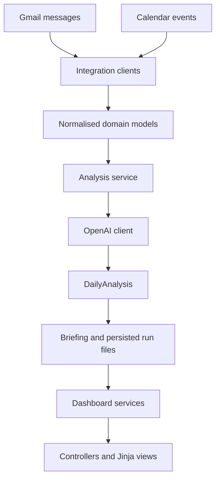

# Architecture

## Overview

The assistant separates external integrations, typed data, application logic, HTTP delivery, and presentation. This makes it possible to test business behaviour without calling Gmail, Calendar, or OpenAI during every test.

## Layers

### Integrations

Integration modules isolate provider-specific authentication and API calls. Expected examples include Google authentication, Gmail, Calendar, and OpenAI clients. They should return application models or simple provider-neutral data rather than leaking provider objects throughout the codebase.

### Models

Pydantic models define the contracts between layers. Typical models include email messages, calendar events, daily analysis, API responses, dashboard views, system status, usage information, history items, and history detail.

### Services

Services coordinate integrations and implement application behaviour:

- collect and normalise daily context;
- request structured analysis;
- format and persist an executive briefing;
- retrieve the latest or historical run;
- assemble dashboard view models;
- report usage and integration health.

### Controllers and presentation

FastAPI controllers handle HTTP concerns. Jinja templates and static CSS render the local dashboard. Templates can be redesigned without changing data collection or analysis services.

## Run outputs

Each execution uses a timestamp-based run identifier. The implementation stores structured analysis and briefing text as separate local files, enabling:

- inspection of the model output;
- historical drill-down;
- partial recovery when one output is unavailable;
- deterministic controller tests using mocked services.

Generated files can contain personal information and should remain under an ignored local directory such as `logs/`.

## Design principles

- **Least privilege:** Gmail and Calendar are read-only.
- **Human oversight:** recommendations are advisory.
- **Local-first outputs:** run files stay local by default.
- **Replaceable UI:** the dashboard is not coupled to integrations.
- **Testability:** controllers and services can be tested with mocks.
- **Explicit boundaries:** secrets are configuration, never source code.
